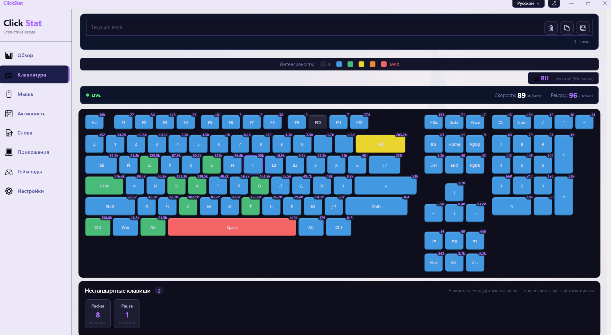
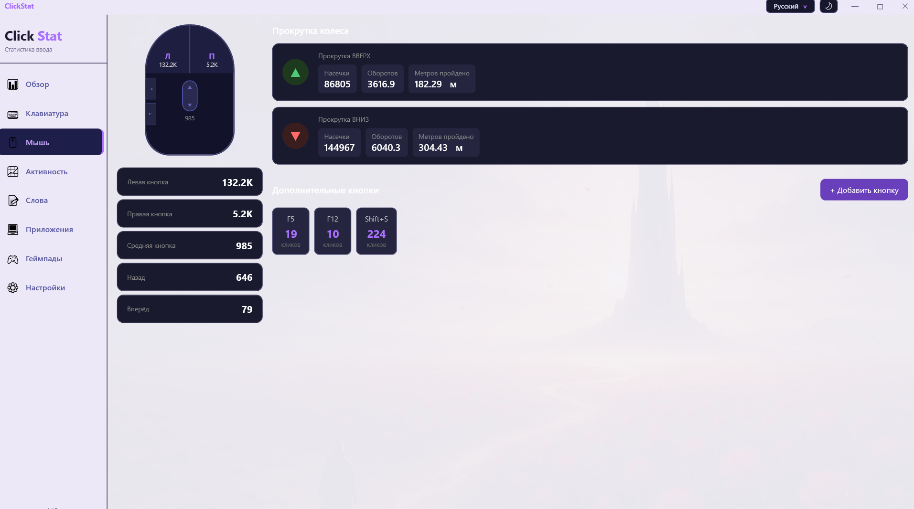
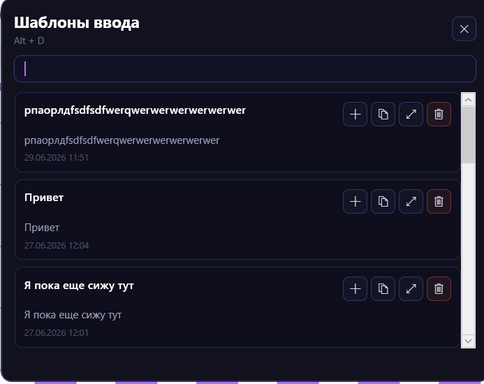

# ClickStat

ClickStat is a Windows desktop app for people who want to understand how they use their keyboard, mouse, apps, words, and gamepads over time. It runs locally, keeps statistics in a SQLite database, and presents the data through a compact WPF interface with dark/light themes, live input feedback, heatmaps, and productivity-oriented views.



## Highlights

- **Keyboard analytics**: per-key counters, heatmap-style intensity, typing speed, session input preview, custom/non-standard key tracking, and layout-aware key labels.
- **Mouse analytics**: left/right/middle/back/forward clicks, wheel distance, wheel rotations, scroll direction stats, and custom mouse button shortcuts.
- **Activity dashboard**: daily charts, weekday activity coefficients, hourly heatmaps, cursor distance, and high-level usage summaries.
- **Words and phrases**: tracks frequent words and phrases by installed keyboard layout, with dynamic language tabs for the layouts available on the machine.
- **Application usage**: groups input activity by foreground application.
- **Gamepad tracking**: detects Xbox, PlayStation/DirectInput, and generic controllers, keeps per-device history, and shows buttons, triggers, sticks, and connection state.
- **Input templates**: save text snippets, search them with `Alt + D`, paste or copy entries, and capture selected text with `Ctrl + Alt + Shift + D`.
- **Themes and localization**: light/dark theme switching, Russian/English UI language switching, and JSON-backed translations.
- **Local-first storage**: data is stored on the current machine under `~/Documents/KeyClick/key_statistics.db`.

## Screenshots

### Keyboard

The keyboard view shows a full keyboard heatmap, live typing speed, current layout, and the temporary session input buffer.


### Mouse

The mouse view separates button clicks, wheel movement, scroll distance, and custom mouse buttons.



### Input Templates

Saved snippets can be searched, expanded, pasted, copied, or deleted from the global template picker.



## Core Features

### Keyboard Tracking

ClickStat records keyboard events and aggregates them into readable statistics:

- total key presses and per-key counts;
- color-coded keyboard intensity;
- live CPM/WPM-style speed display;
- current keyboard layout display;
- custom key discovery for keys that are not part of the standard visual keyboard;
- a temporary session input field that resets when the window is closed;
- clear, copy, and save actions for the current session input.

### Template Buffer

The template system turns typed or selected text into reusable snippets.

- `Alt + D` opens or closes the template picker.
- `Ctrl + Alt + Shift + D` captures selected text into the template buffer.
- Templates support search, preview, expand/collapse, paste, copy, and delete.
- Full text can be loaded only when needed, keeping the picker lightweight.

### Mouse Tracking

Mouse statistics include:

- standard buttons: left, right, middle, back, and forward;
- wheel scroll up/down counters;
- wheel notches, rotations, and estimated distance;
- custom mouse buttons and optional shortcut mapping.

### Activity and Words

ClickStat also builds higher-level usage views:

- activity by day and hour;
- weekday distribution;
- most active day;
- frequent words and phrases;
- language tabs based on installed keyboard layouts.

### Gamepads

The gamepad view is designed for both live feedback and long-term history:

- Xbox/XInput controller support;
- PlayStation and DirectInput-style controller support;
- generic HID joystick support;
- per-device button and stick movement totals;
- connected/disconnected state;
- visual controller layout and compact statistics mode.

### Themes, Language, and Settings

The interface supports:

- dark and light themes;
- top-bar icon-only theme toggle;
- theme selection in settings;
- Russian and English UI language switching;
- JSON translation files in `ClickStat.Presentation/Localization`;
- optional launch on Windows startup;
- custom background image.

## Privacy

ClickStat is local-first. It does not need a server to work and stores its data locally in:

```text
~/Documents/KeyClick/key_statistics.db
```

The app records input statistics and optional text templates. This is powerful, but it also means you should treat the local database as sensitive personal data. If you save snippets or capture selected text, that content is stored locally until you delete it.

## Tech Stack

- **Platform**: Windows desktop
- **UI**: WPF
- **Runtime**: `.NET 10.0 Windows`
- **Storage**: SQLite + Entity Framework Core
- **Charts**: LiveChartsCore + SkiaSharp
- **Input monitoring**: keyboard, mouse, raw input, and gamepad monitoring services
- **Architecture**: split into App, Presentation, Core, and Infrastructure projects

## Project Structure

```text
ClickStat/
├─ ClickStat.App/              # WPF executable entry point
├─ ClickStat.Presentation/     # Views, view models, localization, themes
├─ ClickStat.Core/             # Core services and shared models
├─ ClickStat.Infrastructure/   # SQLite, data processors, input monitoring
├─ docs/images/                # README screenshots
└─ ClickStat.sln
```

## Getting Started

### Requirements

- Windows
- .NET SDK that can build `net10.0-windows`
- Visual Studio, Rider, or the .NET CLI

### Restore

```powershell
dotnet restore ClickStat.sln
```

### Build

```powershell
dotnet build ClickStat.sln --no-restore
```

### Run

```powershell
dotnet run --project ClickStat.App/ClickStat.App.csproj
```

You can also run the compiled executable from:

```text
ClickStat.App/bin/Debug/net10.0-windows/ClickStat.App.exe
```

## Useful Shortcuts

| Shortcut | Action |
| --- | --- |
| `Alt + D` | Open or close the input template picker |
| `Ctrl + Alt + Shift + D` | Capture selected text into the template system |

## Data Location

Most persisted data lives in:

```text
~/Documents/KeyClick/key_statistics.db
```

UI preferences are also saved under `~/Documents/KeyClick`, including theme and language choices.

## Notes for Contributors

- Keep UI strings in localization JSON files when possible.
- Prefer theme-bound colors for reusable UI surfaces so dark and light themes remain consistent.
- Avoid doing heavy polling or database work while a tab is not visible.
- Keep input monitoring and UI rendering separated: processors should batch data, view models should expose state, and views should stay presentation-focused.

## Status

ClickStat is under active development. The current UI version shown in the app is `v1.15`.
